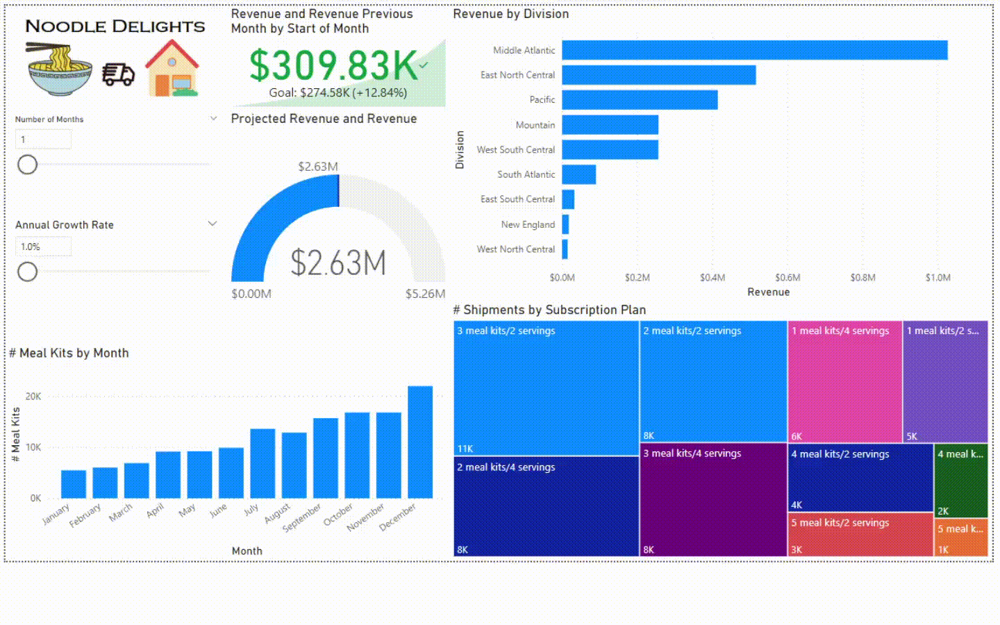

# End-to-End BI Solution tailored for “Noodle Delights” a Meal Kit Delivery Service:

This project demonstrates a comprehensive and dynamic Business Intelligence (BI) solution, highlighting meticulously crafted data models and Key Performance Indicators (KPIs) tailored for in-depth analysis of a meal kit delivery service. Moreover, the project boasts an interactive interface enabling users to finely tune what-if scenarios and allows users to select specific KPIs for visualization and display.

**Data Cleaning Tool: "Microsoft Excel"**

**Transformation and Visualization Tool: "Microsoft Power BI"**

## Data Visualization:
#### Entity Relationship Diagram Model

  

#### Dashboard

  

#### Division Detail

  

## Report & Analysis:
#### Interactive KPI Card Analysis

#### Gauge Chart What-If Analysis

#### Division Detail and Time Series Analysis

